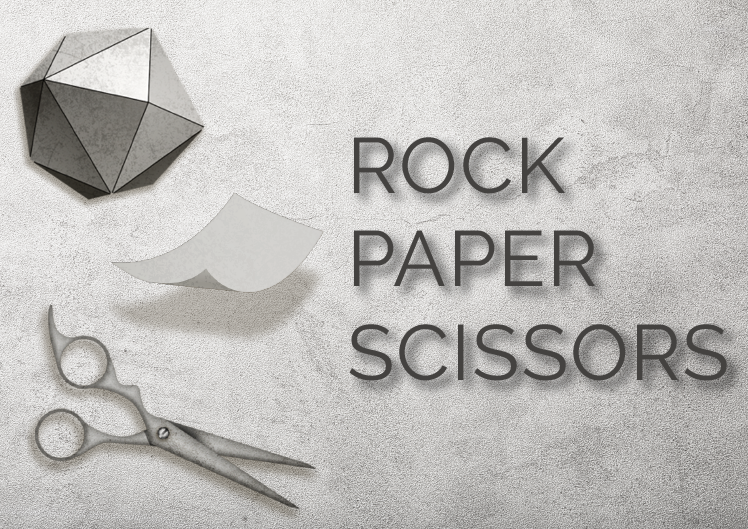

 

# Welcome to RPS - Multiplayer!

#### With interactivity, teamwork, and playfulness at its core, Rock Paper Scissors can now be played online with a friend or coworker across the globe.  Utilizing Firebase in real-time and a custom Bootstrap frontend, this classic game will never be the same.
---

## Table of Contents
  * [Design Process](#design-process)
  * [Technologies](#technologies)
  * [Instructions](#instructions)
  * [Features And Functionality](#features-and-functionality)
  * [File Architecture](#file-architecture)
  * [Click here to play](https://jae-s.github.io/RPS-multiplayer/)
---

## Design Process
```

```
---
## Technologies

> <b>Design Tools:</b>
  * <b>Adobe Illustrator:</b> Graphic assets 
  * <b>Adobe Photoshop:</b> Graphic assets & gifs
  
> <b>Development Tools:</b>
  * <b>Framework:</b> Bootstrap
  * <b>Firebase:</b> Real-time database 
  * HTML  
  * CSS
  * Javascript  
---

## Instructions

    1. RPS requires 2 players to begin. 
    2. The first person to enter their username will be player 1.
    3. When there are 2 players the game will begin.
    4. On your turn, click on one of the images (rock, paper, or scissors) to make your selection.
    5. Once both players have made their selections the winner of that round will be announced.
    6. Message your opponent throughout the game with the real-time chat feature.

---

## Features And Functionality
```

```
---

## File Architecture

         RPS-Multiplayer
         ├── assets
         │   ├── css
         │   │   ├── media_screens.css
         │   │   ├── reset.css
         │   │   └── style.css
         │   ├── images
         │   │   ├── background.jpeg
         │   │   ├── cover_image.png
         │   │   ├── paper.png
         │   │   ├── rock.png
         │   │   ├── RPS_cover.png    
         │   │   ├── RPS_cover_2.png          
         │   │   ├── rps_waiting_2.mp4
         │   │   ├── scissors.png
         │   │   └── static_background.png 
         │   ├── javascript
         │   │   └── game.js
         │   └── sound_effects
         │       └── click.mp3
         ├── index.html
         └── README.md
    
---

[Back To Top](#welcome-to-rps-multiplayer!)